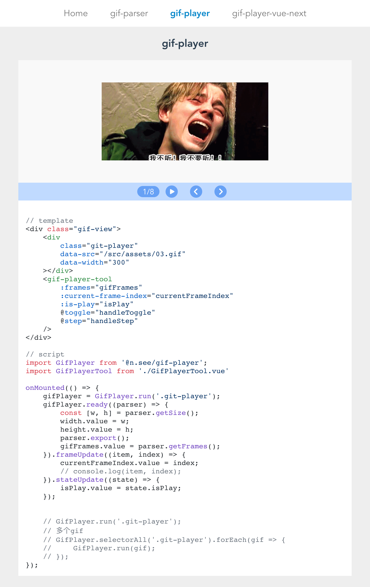

# gif

gif文件流解析，gif播放器



- 解析器：[git-parser](packages/gif-parser)
- 播放器：[gif-player](packages/gif-player)（原生js）
- 播放器：[gif-player-vue-next](packages/gif-player-vue-next)（vue-next组件）

#### demo

```bash
// 克隆到本地
git clone git@github.com:nseeart/gif.git

// 进入gif目录
cd gif

// 安装依赖
npm i

// 运行开发模式命令
npm run dev

// Local: http://localhost:3000/
```
