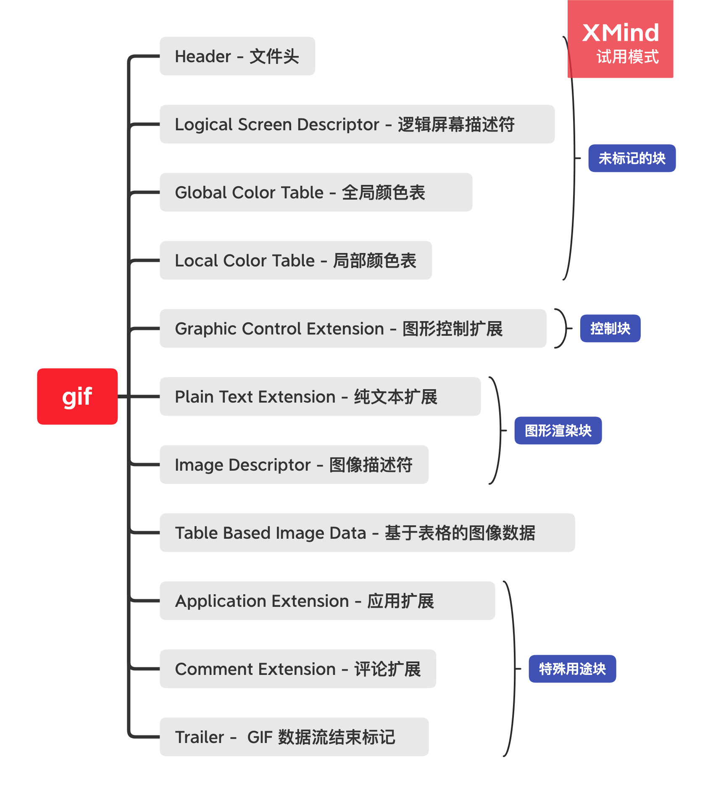
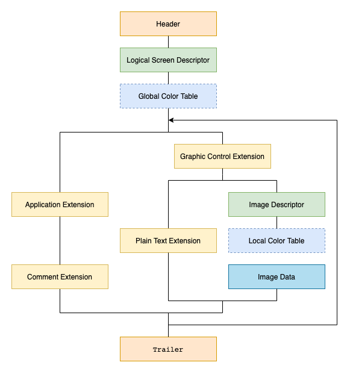

# gif-parser


#### gif文件流组成





[文件流说明](./doc/gif-file.md)


##### 安装

```bash
npm install @n.see/gif-parser --save

```

##### 使用
```javascript
import { Parser, ExportBlockList } from '@n.see/gif-parser';
const parser = new Parser(arrayBuffer);

// 获取gif图片尺寸
const [width: number, height: number] = parser.getSize()；

// 获取gif图片流所有模块数据
const blockList: ExportBlockList = parser.getBlockList();

// 获取gif图片流模块数据
const blockItem: ExportBlockItem = parser.getBlockItem(type: ExportBlockItemType)

// 处理后的数据
parser.export();
// 获取gif图片每帧数据（处理后的数据,需调用“parser.export()”）
const frames: ExportBlockItem = parser.getFrames()

// 获取gif图片流模块数据（处理后的数据,需调用“parser.export()”）
const dataList: ExportBlockList = parser.getDataList()


``` 

##### 功能
- getSize()
- getBlockList()
- getDataList()
- getFrames()
- getBlockItem(type: ExportBlockItemType)
